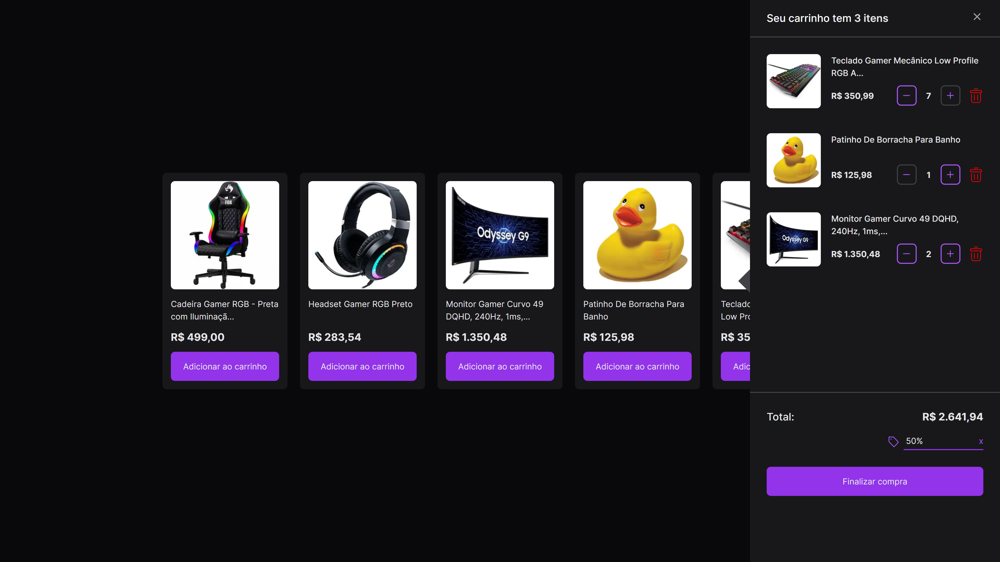

 

  

## 🚀 Tecnologias

Tecnologias utilizadas no projeto:

- ReactJS
- NextJS
- Typescript
- Tailwindcss
- React Toastify

 

## 💻 Projeto

O Shopping Cart é uma aplicação fictícia na qual tem o objetivo criar um sistema de carrinho de compras onde podemos adicionar e remover e colocar cupom de desconto.

 

## ⚒️ Features

- [x] Adicionar produto no carrinho
- [x] Remove produto no carrinho
- [x] Aplica cupom de desconto
- [x] Limite  max/mim dentro do carrinho
- [x] Botão de remove produto do carrinho
- [x] Soma de todos os produtos
- [x] Possui notificações quando algo da errado ou da certo

- [x] Versão web
- [ ] Versão mobile

## 💲 Discount

Cupons valido na aplicação são:

- FREE
- 10%
- 50%
- 55%
- 75%
- 90%

 

## 🔖 Layout

Layout da aplicação no [figma](https://www.figma.com/community/file/1243194167725942248/Carrinho-de-compras-%E2%80%A2-Desafio-21).

 

## 🌐 Deploy

Você pode ver o site clicando <a href="https://shopping-cart-weld-phi.vercel.app/" target="_blank">nesse link</a>.

 

## :memo: Licença

Esse projeto está sob a licença MIT. Veja o arquivo <a href="https://github.com/Gabriel-Sousa/shopping-cart/blob/main/.github/LICENSE" target="_blank">LICENSE</a>  para mais detalhes.

---

Feito com ♥ por Gabriel Sousa
